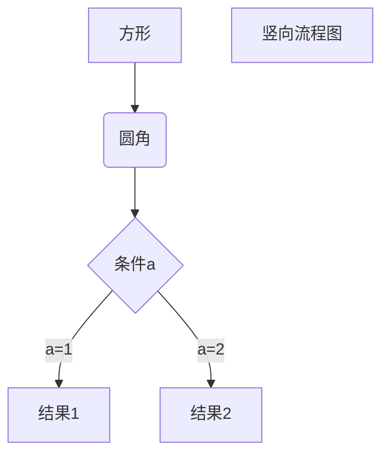

# 前端笔记
https://www.jianshu.com/p/7771794c88a1

   ## layui相关笔记
   
   ### layui 使用
   ```
    layui.config({
        base: '/static/js/tableTree/'
    }).extend({
        tableEdit:'tableEdit'  //表格树依赖我另外写的tableEdit模块，本项目就有。
        ,tableTree:'tableTree'
    }).use(['table','tableEdit','layer',"tableTree"], function () {
        var table = layui.table
            ,tableEdit = layui.tableEdit
            ,tableTree = layui.tableTree;
    });
```
   
   #### layui的左侧树形菜单栏
   ```
     
   ```
   
   #### layui和tableTree组件的运用
   ```
    //数据源，必须有treeList字段
    [{"id":11,"name":"张三11","treeList":[{"id":14,"name":"张三14","treeList":[{"id":15,"name":"张三15","danxuan":null,"duoxuan":[{"name":1,"value": "张三1"},{"name":2,"value": "张三2"}],"birthday":""}],"danxuan":null,"duoxuan":[{"name":1,"value": "张三1"},{"name":2,"value": "张三2"}],"birthday":""}],"danxuan":null,"duoxuan":[{"name":1,"value": "张三1"},{"name":2,"value": "张三2"}],"birthday":""},
        {"id":12,"name":"张三12","danxuan":null,"duoxuan":[{"name":1,"value": "张三1"},{"name":2,"value": "张三2"}],"birthday":""},
        {"id":13,"name":"张三13","danxuan":null,"duoxuan":[{"name":1,"value": "张三1"},{"name":2,"value": "张三2"}],"birthday":""}
    ];
    
    
```
   
   

   
   
   ## VUE相关笔记